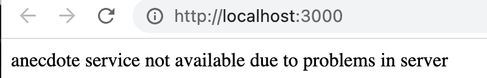

# Exercises 6.20.-6.22

Now let's make a new version of the anecdote application that uses the React Query library. Take [this](https://github.com/fullstack-hy2020/query-anecdotes) project as your starting point. The project has a ready-installed JSON Server, the operation of which has been slightly modified (Review the `server.js` file for more details. Make sure you're connecting to the correct `PORT`). Start the server with npm run server.

## Exercise 6.20

Implement retrieving anecdotes from the server using React Query.

The application should work in such a way that if there are problems communicating with the server, only an error page will be displayed:



You can find [here](https://tanstack.com/query/latest/docs/framework/react/guides/queries) info how to detect the possible errors.

You can simulate a problem with the server by e.g. turning off the JSON Server. Please note that in a problem situation, the query is first in the state _isLoading_ for a while, because if a request fails, React Query tries the request a few times before it states that the request is not successful. You can optionally specify that no retries are made:

```jsx
const result = useQuery({
  queryKey: ['anecdotes'],
  queryFn: getAnecdotes,
  retry: false,
});
```

or that the request is retried e.g. only once:

```jsx
const result = useQuery({
  queryKey: ['anecdotes'],
  queryFn: getAnecdotes,
  retry: 1,
});
```

## Exercise 6.21

Implement adding new anecdotes to the server using React Query. The application should render a new anecdote by default. Note that the content of the anecdote must be at least 5 characters long, otherwise the server will reject the POST request. You don't have to worry about error handling now.

## Exercise 6.22

Implement voting for anecdotes using again the React Query. The application should automatically render the increased number of votes for the voted anecdote.
