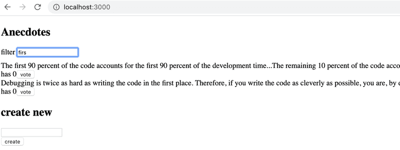
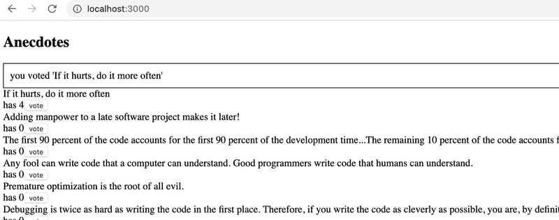

# Exercises 6.3.-6.8

Let's make a new version of the anecdote voting application from part 1. Take the project from this repository <https://github.com/fullstack-hy2020/redux-anecdotes> as the base of your solution.

If you clone the project into an existing git repository, _remove the git configuration of the cloned application:_

```bash
cd redux-anecdotes  // go to the cloned repository
rm -rf .git
```

The application can be started as usual, but you have to install the dependencies first:

```bash
npm install
npm run dev
```

After completing these exercises, your application should look like this:


## 6.3: Anecdotes, step 1

Implement the functionality for voting anecdotes. The number of votes must be saved to a Redux store.

## 6.4: Anecdotes, step 2

Implement the functionality for adding new anecdotes.

You can keep the form uncontrolled like we did [earlier](https://fullstackopen.com/en/part6/flux_architecture_and_redux#uncontrolled-form).

## 6.5: Anecdotes, step 3

Make sure that the anecdotes are ordered by the number of votes.

## 6.6: Anecdotes, step 4

If you haven't done so already, separate the creation of action-objects to [action creator-functions](https://read.reduxbook.com/markdown/part1/04-action-creators.html) and place them in the _src/reducers/anecdoteReducer.js_ file, so do what we have been doing since the chapter [action creators](https://fullstackopen.com/en/part6/flux_architecture_and_redux#action-creators).

## 6.7: Anecdotes, step 5

Separate the creation of new anecdotes into a component called _AnecdoteForm_. Move all logic for creating a new anecdote into this new component.

## 6.8: Anecdotes, step 6

Separate the rendering of the anecdote list into a component called _AnecdoteList_. Move all logic related to voting for an anecdote to this new component.

Now the App component should look like this:

```jsx
import AnecdoteForm from './components/AnecdoteForm';
import AnecdoteList from './components/AnecdoteList';

const App = () => {
  return (
    <div>
      <h2>Anecdotes</h2>
      <AnecdoteList />
      <AnecdoteForm />
    </div>
  );
};

export default App;
```

## Exercise 6.9

### 6.9 Better Anecdotes, step 7

Implement filtering for the anecdotes that are displayed to the user.



Store the state of the filter in the redux store. It is recommended to create a new reducer, action creators, and a combined reducer for the store using the _combineReducers_ function.

Create a new _Filter_ component for displaying the filter. You can use the following code as a template for the component:

```jsx
const Filter = () => {
  const handleChange = event => {
    // input-field value is in variable event.target.value
  };
  const style = {
    marginBottom: 10,
  };

  return (
    <div style={style}>
      filter <input onChange={handleChange} />
    </div>
  );
};

export default Filter;
```

## Exercises 6.10.-6.13

Let's continue working on the anecdote application using Redux that we started in exercise 6.3.s

### 6.10 Better Anecdotes, step 8

Install Redux Toolkit for the project. Move the Redux store creation into the file _store.js_ and use Redux Toolkit's `configureStore` to create the store.

Change the definition of the _filter reducer_ and action _creators_ to use the Redux Toolkit's createSlice function.

Also, start using Redux DevTools to debug the application's state easier.

### 6.11 Better Anecdotes, step 9

Change also the definition of the anecdote reducer and action creators to use the Redux Toolkit's `createSlice` function.

Implementation note: when you use the Redux Toolkit to return the initial state of anecdotes, it will be immutable, so you will need to make a copy of it to sort the anecdotes, or you will encounter the error "TypeError: Cannot assign to read only property". You can use the spread syntax to make a copy of the array. Instead of:

```js
anecdotes.sort();
```

Write:

```js
[...anecdotes].sort();
```

### 6.12 Better Anecdotes, step 10

The application has a ready-made body for the _Notification_ component:

```jsx
const Notification = () => {
  const style = {
    border: 'solid',
    padding: 10,
    borderWidth: 1,
  };
  return <div style={style}>render here notification...</div>;
};

export default Notification;
```

Extend the component so that it renders the message stored in the Redux store, making the component take the following form:

```jsx
import { useSelector } from 'react-redux';

const Notification = () => {
  const notification = useSelector(/* something here */);
  const style = {
    border: 'solid',
    padding: 10,
    borderWidth: 1,
  };
  return <div style={style}>{notification}</div>;
};
```

You will have to make changes to the application's existing reducer. Create a separate reducer for the new functionality by using the Redux Toolkit's `createSlice` function.

The application does not have to use the _Notification_ component intelligently at this point in the exercises. It is enough for the application to display the initial value set for the message in the _notificationReducer_.

### 6.13 Better Anecdotes, step 11

Extend the application so that it uses the _Notification_ component to display a message for five seconds when the user votes for an anecdote or creates a new anecdote:



It's recommended to create separate [action creators](https://redux-toolkit.js.org/api/createSlice#reducers) for setting and removing notifications.

## Exercises 6.14.-6.15

### 6.14 Anecdotes and the Backend, step 1

When the application launches, fetch the anecdotes from the backend implemented using json-server.

As the initial backend data, you can use, e.g. [this](https://github.com/fullstack-hy2020/misc/blob/master/anecdotes.json).

### 6.15 Anecdotes and the Backend, step 2

Modify the creation of new anecdotes, so that the anecdotes are stored in the backend.

## Exercises 6.16.-6.19

### 6.16 Anecdotes and the Backend, step 3

Modify the initialization of the Redux store to happen using asynchronous action creators, which are made possible by the Redux Thunk library.

### 6.17 Anecdotes and the Backend, step 4

Also modify the creation of a new anecdote to happen using asynchronous action creators, made possible by the Redux Thunk library.

### 6.18 Anecdotes and the Backend, step 5

Voting does not yet save changes to the backend. Fix the situation with the help of the Redux Thunk library.
