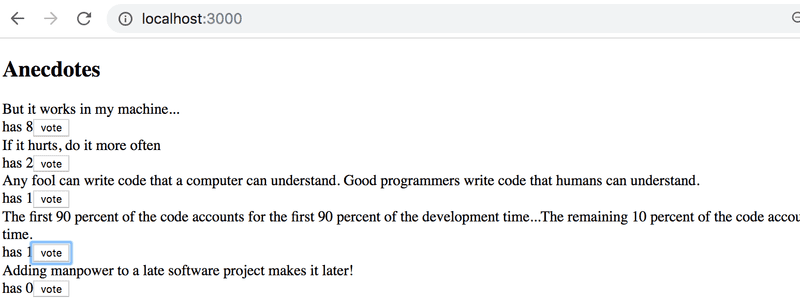

# Exercises 6.3.-6.8

Let's make a new version of the anecdote voting application from part 1. Take the project from this repository <https://github.com/fullstack-hy2020/redux-anecdotes> as the base of your solution.

If you clone the project into an existing git repository, _remove the git configuration of the cloned application:_

```bash
cd redux-anecdotes  // go to the cloned repository
rm -rf .git
```

The application can be started as usual, but you have to install the dependencies first:

```bash
npm install
npm run dev
```

After completing these exercises, your application should look like this:



## 6.3: Anecdotes, step 1

Implement the functionality for voting anecdotes. The number of votes must be saved to a Redux store.

## 6.4: Anecdotes, step 2

Implement the functionality for adding new anecdotes.

You can keep the form uncontrolled like we did [earlier](https://fullstackopen.com/en/part6/flux_architecture_and_redux#uncontrolled-form).
